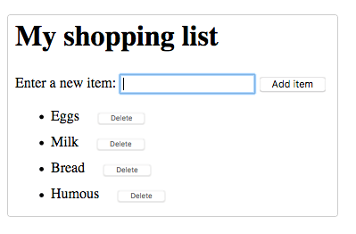

# MDN Challenge: Building A Dynamic Shopping List

This my solution to the [Mozilla Developer Network's Dynamic Shopping List Challenge](https://developer.mozilla.org/en-US/docs/Learn/JavaScript/Client-side_web_APIs/Manipulating_documents#active_learning_a_dynamic_shopping_list). The main learning objective was to gain familiarity with:

- the core DOM APIs 
- other APIs commonly associated with DOM and document manipulation.  

- [Overview](#overview)
  - [The challenge](#the-challenge)
  - [Solution Link](#solution-link)
- [My process](#my-process)
  - [Built with](#built-with)
  - [What I learned](#what-i-learned)
  - [Continued development](#continued-development)
  - [Useful resources](#useful-resources)

## Overview

### The challenge

In this challenge we want to make a simple shopping list example that allows users to dynamically add items to the list using a form input and button. When you add an item to the input and press the button:

-    The item should appear in the list.
-    Each item should be given a button that can be pressed to delete that item off the list.
-    The input should be emptied and focused ready for you to enter another item.

The finished demo will look something like this:

### Solution Link

- Live Site URL: [here](https://bytesandroses.github.io/shopping-list/)

## My process

### Built with

- Semantic HTML5 markup
- CSS custom properties
- Flexbox
- Javascript

### What I learned

### Continued development

### Useful resources